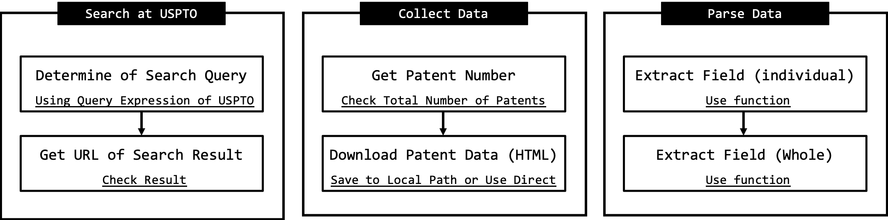

```{r knitr_init, echo=FALSE, cache=FALSE, warning=FALSE}
library(knitr)
library(rmdformats)

## Global options
options(max.print="75")
opts_chunk$set(echo=TRUE,
	             cache=FALSE,
               prompt=FALSE,
               tidy=TRUE,
               comment=NA,
               message=FALSE,
               warning=FALSE)
opts_knit$set(width=75)
```


```{r, message=FALSE, warning=FALSE, include=FALSE}
package_need <- c("tidyverse","jsonlite","pbapply","rvest","XML")
if(!requireNamespace(package_need)) install.packages(package_need)
package_installed <- lapply(package_need, require, character.only = TRUE)
names(package_installed) <- package_need
options(scipen = 999)
source("../R/getData.R")
```


```{r echo=FALSE}
htmltools::img(src = knitr::image_uri('../Document/Lab Logo.png'), alt = 'logo', style = 'position:absolute; top:0; right:0; padding:10px;')
```


<br><br>

위 문서는 R로 작성된 `googlePatentR` 패키지를 활용하여 특허 데이터를 수집하고 전처리 하는 과정에 대한 내용을 포함하고 있습니다.  

<br>

**googlePatentR 패키지의 모든 소유권은 [서울과학기술대학교 서비스혁신연구실](https://sites.google.com/ds.seoultech.ac.kr/smlab)에 있음을 밝힙니다**


<br><br>


# 개요  

  특허분석이란 특허 정보속에 포함되어 있는 서지사항과 기술적인 사항을 활용하여 특정 목적에 부합하도록 분석하고 그 결과를 한 눈에 파악할 수 있도록 시각적으로 표현하는 것을 의미합니다. 특허 문서에는 특허번호, 발명자, 출원인, 청구항, 인용정보, 기술 분류와 같은 다양한 정보들이 정형화된 기준에 맞춰 포함되어 있으며, 요약, 청구항, 설명서와 같은 텍스트로 구성된 정보들도 포함되어 있기에 항목들이 분석 목적에 따라 다양한 형태로 분석에 활용이 가능합니다.  

이러한 특허정보를 활용하여 빈도분석, 시계열분석, 동시분류분석, 인용분석, 네트워크분석, 컨조인트분석, 델파이분석과 같은 분석방법을 활용하여 다양한 각도에서 목적에 맞춰 분석이 이뤄지고 있습니다.   

이러한 분석들은 기술과 산업의 형태와 구조를 파악 위해 혹은 기술 사이의 관계를 정의하거나 앞으로의 기술을 예측하기 위한 목적으로 다양한 연구에서 다뤄져왔습니다. 이뿐만이 아니라 특허가 가지고 있는 가치를 평가하거나 특허의 출원 및 등록 과정에 초점을 둔 연구들도 다양하게 이뤄지고 있습니다.  

<br>

 특허분석의 가장 첫 단계는 특허를 수집하고 원하는 형태로 전처리하는 과정입니다. 앞으로 다룰 메소드들을 활용한다면 분석을 원하는 특허를 수집하고 원하는 정보만 추출 및 가공할 수 있습니다.   

<br>

  


<br><br><br>

# 특허 데이터 수집 함수

<br>

## 사용 패키지 확인
```{r, comment=NA}
print(unlist(package_installed))
```
<br>

## func_get_patent_number
[USPTO](http://patft.uspto.gov/netahtml/PTO/search-adv.htm)에서 검색쿼리에 맞는 특허들의 특허번호를 가져오는 메소드입니다.  

  - @param **page_url** : 검색결과 페이지의 URL
  - @return : vector 타입의 특허번호

```{r, comment=NA , warning=FALSE, eval=FALSE}
func_get_patent_number(page_url = " ")
```

<br>

**사용 방법**

**func_get_patent_number()** 의 활용을 위해선 USPTO에서의 검색 결과에 대한 URL이 필요합니다. 우선 USPTO의 Advanced Search에서 원하는 filter를 거친 특허 검색의 결과를 확인합니다. USPTO에 있는 [Syntax](http://patft.uspto.gov/netahtml/PTO/search-adv.htm)를 기준으로 원하는 특허들을 검색할 수 있습니다.  

<br>

**검색 예시**  
제목에 "Apple"이 포함된 Utility Patent  

<br>  

> TTL/"Apple" AND APT/1  

<br><br>

**사용 예시**  
메소드의 사용 시작과 끝은 PUSH로 확인할 수 있으며, 검색되는 특허가 많은 경우 페이지 탐색에 생각보다 긴 시간이 소요될 수 있습니다.  
주의사항 : 검색된 특허의 특허번호에 국가의 코드를 추가해야 이후 메소드에 활용할 수 있습니다. 

```{r, comment=NA , warning=FALSE}
list_patent_number <- paste0("US",
                             func_get_patent_number(page_url = "http://patft.uspto.gov/netacgi/nph-Parser?Sect1=PTO2&Sect2=HITOFF&u=%2Fnetahtml%2FPTO%2Fsearch-adv.htm&r=0&p=1&f=S&l=50&Query=TTL%2F%22Apple%22+AND+APT%2F1%0D%0A&d=PTXT"))
```

<br><br>

## func_download_html  
  
**func_get_patent_number()**의 결과에 국가코드를 추가한 특허번호를 대상으로 Google Patent에서 개별 특허의 상세 페이지를 html로 다운 받습니다.   

  - @param **patent_number** : 국가 코드가 추가된 단일 특허번호
  - @param **output_path** : HTML이 저장될 로컬 경로 
  - @return : 다운로드 결과 T/F
  
```{r, comment=NA , warning=FALSE, eval=FALSE}
func_download_html(patent_number = "list", output_path = "path")
```

<br>

**사용 방법**

위 메소드는 개별 특허번호를 입력으로 받기 때문에 다수의 특허를 다운로드 하기 위해선 반복문을 활용해야 합니다.  
for문의 사용보단 *apply 계열의 함수 사용을 권장하며, **pbapply**의 변형함수인 **pbmapply**를 통해 예상소요시간과 진행도 체크를 가능하게 했습니다.  

<br>

**사용 예시**

```{r eval=FALSE, warning=FALSE, comment=NA}
list_download_result <- pbmapply(func_download_html,
                                 patent_number = list_patent_number,
                                 output_path = "../Output_Html/")
```

<br><br><br>


# 특허 정보 개별 추출 함수 

<br>

## func_get_xxx 계열 함수 

수집된 특허 데이터에서 원하는 특허 정보를 추출하는 함수입니다. **func_get_xxx** 형태입니다.  
**func_get_xxx** 계열 함수들의 경우 사용되는 parameter는 동일하며, 각 메소드의 이름과 같은 값을 반환합니다. 모든 반환값은 character vector 타입입니다.  

입력 parameter의 경우 로컬의 HTML 과 웹의 HTML을 파싱하는 방법 중 선택할 수 있습니다. 로컬 HTML의 경우는 path를 입력해주며, 웹 HTML의 경우 특허번호를 입력해주면 됩니다. **DIRECTLY** flag로 원하는 입력 방식을 선택할 수 있습니다. (Default = TRUE)

  - @param **patent** : 국가 코드가 추가된 단일 특허번호 혹은 로컬 HTML 파일
  - @param **DIRECTLY**: TRUE (웹 HTML) , FALSE (로컬 HTML) 
  - @return : 다운로드 결과 T/F  

<br><br>


## func_get_title  

입력받은 특허에서 제목(title)을 추출합니다.   

```{r, comment=NA , warning=FALSE, eval=FALSE}
func_get_title(patent = " ") #Default
func_get_title(patent = read_html(" .html"), DIRECTLY = FALSE) #From Local
```

<br>

**사용 예시**  

```{r, comment=NA , warning=FALSE}
func_get_title(patent = "US10174378")
```

```{r, comment=NA , warning=FALSE}
func_get_title(patent = read_html("../Output_Html/US10174378.html"), DIRECTLY = FALSE)
```

<br><br>

## func_get_abstract  

입력받은 특허에서 초록(abstract)를 추출합니다.  

```{r, comment=NA , warning=FALSE, eval=FALSE}
func_get_abstract(patent = " ") #Default
func_get_abstract(patent = read_html(" .html"), DIRECTLY = FALSE) #From Local
```

<br>

**사용 예시**  

```{r, comment=NA , warning=FALSE}
func_get_abstract(patent = "US10174378")
```

```{r, comment=NA , warning=FALSE}
func_get_abstract(patent = read_html("../Output_Html/US10174378.html"), DIRECTLY = FALSE) 
```

<br><br>

## func_get_inventor  

입력받은 특허에서 발명가(inventor)를 추출합니다. 


```{r, comment=NA , warning=FALSE, eval=FALSE}
func_get_inventor(patent = " ") #Default
func_get_inventor(patent = read_html(" .html"), DIRECTLY = FALSE) #From Local
```

<br>

**사용 예시**  

```{r, comment=NA , warning=FALSE}
func_get_inventor(patent = "US10174378")
```

```{r, comment=NA , warning=FALSE}
func_get_inventor(patent = read_html("../Output_Html/US10174378.html"), DIRECTLY = FALSE) 
```

<br><br>


## func_get_assignee  

입력받은 특허에 출원인(회사)를 추출합니다.  


```{r, comment=NA , warning=FALSE, eval=FALSE}
func_get_assignee(patent = " ") #Default
func_get_assignee(patent = read_html(" .html"), DIRECTLY = FALSE) #From Local
```

<br>

**사용 예시**  

```{r, comment=NA , warning=FALSE}
func_get_assignee(patent = "US10174378")
```

```{r, comment=NA , warning=FALSE}
func_get_assignee(patent = read_html("../Output_Html/US10174378.html"), DIRECTLY = FALSE) 
```

<br><br>


## func_get_issued_date  

입력받은 특허에서 등록 날짜 (Issued_date)를 추출합니다.


```{r, comment=NA , warning=FALSE, eval=FALSE}
func_get_issued_date(patent = " ") #Default
func_get_issued_date(patent = read_html(" .html"), DIRECTLY = FALSE) #From Local
```

<br>

**사용 예시**  

```{r, comment=NA , warning=FALSE}
func_get_issued_date(patent = "US10174378")
```

```{r, comment=NA , warning=FALSE}
func_get_issued_date(patent = read_html("../Output_Html/US10174378.html"), DIRECTLY = FALSE) 
```

<br><br>


## func_get_submitted_date  

입력받은 특허에서 출원 날짜 (Submitted_date)를 추출합니다.  

```{r, comment=NA , warning=FALSE, eval=FALSE}
func_get_submitted_date(patent = " ") #Default
func_get_submitted_date(patent = read_html(" .html"), DIRECTLY = FALSE) #From Local
```

<br>

**사용 예시**  

```{r, comment=NA , warning=FALSE}
func_get_submitted_date(patent = "US10174378")
```

```{r, comment=NA , warning=FALSE}
func_get_submitted_date(patent = read_html("../Output_Html/US10174378.html"), DIRECTLY = FALSE) 
```

<br><br>


## func_get_cpc  

입력받은 특허에서 기술 분류 (classification) 정보를 추출합니다. (Google Patent는 CPC만 지원) 
  
```{r, comment=NA , warning=FALSE, eval=FALSE}
func_get_cpc(patent = " ") #Default
func_get_cpc(patent = read_html(" .html"), DIRECTLY = FALSE) #From Local
```

<br>

**사용 예시**  

```{r, comment=NA , warning=FALSE}
func_get_cpc(patent = "US10174378")
```

```{r, comment=NA , warning=FALSE}
func_get_cpc(patent = read_html("../Output_Html/US10174378.html"), DIRECTLY = FALSE) 
```

<br><br>


## func_get_description  

입력받은 특허에서 명세서(Decription) 정보를 추출합니다. 길이가 매우 긴 단일 문자열 입니다.

```{r, comment=NA , warning=FALSE, eval=FALSE}
func_get_description(patent = " ") #Default
func_get_description(patent = read_html(" .html"), DIRECTLY = FALSE) #From Local
```

<br>

**사용 예시**  

```{r, comment=NA , warning=FALSE}
func_get_description(patent = "US10174378") %>% str_sub(start = 1, end = 200)
```

```{r, comment=NA , warning=FALSE}
func_get_description(patent = read_html("../Output_Html/US10174378.html"), DIRECTLY = FALSE) %>% str_sub(start = 1, end = 200)
```

<br><br>


## func_get_claims  

입력받은 특허에서 청구항(claims)정보를 추출합니다.

```{r, comment=NA , warning=FALSE, eval=FALSE}
func_get_claims(patent = " ") #Default
func_get_claims(patent = read_html(" .html"), DIRECTLY = FALSE) #From Local
```

<br>

**사용 예시**  

```{r, comment=NA , warning=FALSE}
func_get_claims(patent = "US10174378") %>% str_sub(start = 1, end = 200)
```

```{r, comment=NA , warning=FALSE}
func_get_claims(patent = read_html("../Output_Html/US10174378.html"), DIRECTLY = FALSE) %>% str_sub(start = 1, end = 200)
```

<br><br>

## func_get_citation  
  
```{r, comment=NA , warning=FALSE, eval=FALSE}
func_get_citation(patent = " ") #Default
func_get_citation(patent = read_html(" .html"), DIRECTLY = FALSE) #From Local
```

<br>

**사용 예시**  

```{r, comment=NA , warning=FALSE}
func_get_citation(patent = "US10174378")
```

```{r, comment=NA , warning=FALSE}
func_get_citation(patent = read_html("../Output_Html/US10174378.html"), DIRECTLY = FALSE) 
```

<br><br>


## func_get_cited  
  
입력받은 특허에서 피인용(cited)정보를 추출합니다.

```{r, comment=NA , warning=FALSE, eval=FALSE}
func_get_cited(patent = " ") #Default
func_get_cited(patent = read_html(" .html"), DIRECTLY = FALSE) #From Local
```

<br>

**사용 예시**  

```{r, comment=NA , warning=FALSE}
func_get_cited(patent = "US10174378")
```

```{r, comment=NA , warning=FALSE}
func_get_cited(patent = read_html("../Output_Html/US10174378.html"), DIRECTLY = FALSE) 
```

<br><br><br> 


# 특허 정보 통합 추출 함수  

<br>

## func_get_total_patent_information  

앞서 3절에서 사용했던 함수를 한번에 통합해둔 함수 입니다. 한번의 입력으로 모든 정의된 모든 특허정보를 추출할 수 있으며, 각각의 필드는 이름이 있는 리스트 타입으로 정의되어 있습니다. (Named List)

  - @param **patent_number** : 단일 특허번호
  - @param **fromLocal** : TRUE (로컬 HTML) , FALSE (웹 HTML)
  - @param **Local_path** : 로컬 HTML인 경우의 로컬 경로
  - @return : 여러개의 named list가 포함된 list 

<br>

```{r, comment=NA , warning=FALSE, eval=FALSE}
# TODO Read From Local Path
func_get_total_patent_information(list_patent_number = " ",
                                  fromLocal = TRUE,
                                  Local_path = "../Output_Html/")
```

```{r, comment=NA , warning=FALSE, eval=FALSE}
# TODO Read From HTTPS Path
func_get_total_patent_information(list_patent_number = " ")
```

<br>


**사용 예시**  

```{r, comment=NA , warning=FALSE}
# TODO Read From Local Path
output <- func_get_total_patent_information(list_patent_number = "US10174378",
                                            fromLocal = TRUE,
                                            Local_path = "../Output_Html/")
output %>% str()
```

```{r, comment=NA , warning=FALSE}
# TODO Read From HTTPS Path
output <- func_get_total_patent_information(list_patent_number = "US6735569")
output %>% str()
```


<br><br><br>


# 특허 수집 및 전처리 예시  

<br>

## 수집 대상 특허 검색  

가장 먼저 대상 특허들을 정의하고 특허번호를 가져옵니다. 앞서 2절에서 사용한 대상 특허를 예시로 활용해보겠습니다.

<br>

> TTL/"Apple" AND APT/1  

<br><br>

실제 USPTO에서의 검색 결과(아래 그림)를 확인했을 때 총 60개의 특허가 검색되는 것을 확인할 수 있습니다. **func_get_patent_number** 메소드를 실행하고, 그 결과를 확인하면 60개로 같은 특허번호가 수집된 것을 확인 할 수 있습니다. 


```{r warning=FALSE, comment=NA, cache= TRUE}
list_patent_number <- paste0("US", func_get_patent_number(page_url = "http://patft.uspto.gov/netacgi/nph-Parser?Sect1=PTO2&Sect2=HITOFF&u=%2Fnetahtml%2FPTO%2Fsearch-adv.htm&r=0&f=S&l=50&d=PTXT&RS=%28TTL%2F%22Stylus+pen%22+AND+APT%2F1%29&Refine=Refine+Search&Query=TTL%2F%22Apple%22+AND+APT%2F1"))
```

```{r warning=FALSE, comment=NA, cache= TRUE}
list_patent_number %>% length()
list_patent_number %>% head(5)
```

<br><br>

## 수집 대상 특허 수집  

앞서 수집된 특허 번호들을 대상으로 개별 특허의 HTML을 로컬로 저장합니다.  
pbmapply를 통해 수집을 하지만, for와 같은 일반적인 반복문으로도 사용 가능합니다.  
**list_download_result**엔 입력값으로 받은 특허들의 다운로드 성공/실패 여부가 들어가 있습니다. 

```{r warning=FALSE, comment=NA, cache= TRUE}
list_download_result <- pbmapply(func_download_html,
                                 patent_number = list_patent_number,
                                 output_path = "../Output_Html/")

```

<br>

특허가 아래와 같이 다운로드 된 것을 확인 할 수 있으며, 60개가 모두 성공적으로 다운로드 된 것을 확인 할 수 있습니다. 

```{r warning=FALSE, comment=NA}
list_download_result %>% head(5)
list_download_result %>% table()
```

```{r warning=FALSE, comment=NA}
tbl_patent_number <- tibble(patent_number = names(list_download_result),
                            exist = list_download_result)
```

```{r warning=FALSE, comment=NA, paged.print=TRUE}
tbl_patent_number %>% print()
```
<br>

로컬 Path에 실제 값들이 저장 된 것을 확인해보도록 하겠습니다.  
".html" 확장자를 가진 파일들이 개별 특허번호를 파일명으로 저장된 것을 확인 할 수 있습니다.  

```{r warning=FALSE, comment=NA}
list.files("../Output_Html/")[list.files("../Output_Html/") %>% str_detect(".html")] %>% head(5)
```

<br><br>

## 수집 대상 특허 개별 정보 추출  

먼저 3절에 다룬 특허의 정보를 개별로 추출하는 메소드를 사용해보겠습니다.  
앞서 수집한 특허 중 1개의 특허를 통해 확인해보도록 하겠습니다.  

예시 특허 : [**Composition comprising cashew apple extract**](https://patents.google.com/patent/US10028970)  


Google Patent 검색 화면  
  

<br><br>

**func_get_xxx**계열의 함수는 웹에서 바로 필요한 정보를 가져오는 방식과 로컬에 있는 파일을 가져오는 방식으로 나뉘어져 있습니다. 웹에서 바로 파싱을 하는 경우에는 특허번호만 입력해주면 되며, 로컬 파일에서 파싱을 하는 경우는 **xml2::read_html()**를 사용하여 생성된 객체를 입력해주어야 합니다.  


```{r warning=FALSE, comment=NA, cache= TRUE}  
#Title
func_get_title(patent = "US10028970")
```

<br>

```{r warning=FALSE, comment=NA, cache= TRUE}  
#Title
func_get_title(patent = read_html("../Output_Html/US10028970.html"), DIRECTLY = FALSE)
```

<br><br>


## 수집 대상 특허 통합 정보 추출  

다음은 4절에서 다룬 통합 메소드인 **func_get_total_patent_information**를 기반으로 특허 정보를 추출해보도록 하겠습니다. 

```{r warning=FALSE, comment=NA, cache= TRUE}  
# From Local Path
output <- func_get_total_patent_information(list_patent_number = "US10028970",
                                            fromLocal = TRUE,
                                            Local_path = "../Output_Html/")
```

<br>

```{r warning=FALSE, comment=NA, cache= TRUE}  
output %>% str()
```

<br>

```{r warning=FALSE, comment=NA, cache= TRUE}  
# From HTTPS Path
output <- func_get_total_patent_information(list_patent_number = "US10028970")
```

<br>

```{r warning=FALSE, comment=NA, cache= TRUE}  
output %>% str()
```


<br><br>

## 다량의 특허 통합 정보 추출  

이제 다량의 특허 정보를 한번에 추출해보도록 하겠습니다. lapply를 사용하여 60개의 함수의 모든 필드를 추출해보도록 하겠습니다.  lapply를 활용했기 때문에 결과들은 다중 리스트 구조로 저장이 되어 있으며, 리스트는 개별 특허 번호를 Key값으로 가지고 있습니다. 

```{r warning=FALSE, comment=NA, cache= TRUE}  
output <- func_get_total_patent_information(list_patent_number = tbl_patent_number$patent_number)
```
```{r warning=FALSE, comment=NA, cache= TRUE}  
output[1:2] %>% str()
```

<br>

```{r warning=FALSE, comment=NA, cache= TRUE}  
output <- func_get_total_patent_information(list_patent_number = tbl_patent_number$patent_number,
                                            fromLocal = TRUE,
                                            Local_path = "../Output_Html/")
```

```{r warning=FALSE, comment=NA, cache= TRUE}  
output[1:2] %>% str() 
```


<br><br><br>

# 전처리된 특허의 저장 

전처리가 완료된 특허를 저장해보겠습니다. 출력의 예시는 2가지 타입이며 활용 방향을 고려하여 적합한 형태로 데이터를 저장합니다.

<br>

## R Object (.rds) 방식

rds는 R에서 사용되는 변수나 환경정보를 저장하는 객체입니다. 원하는 변수를 지정하여 rds로 출력하게 되면 다른 분석환경에서 기존에 저장해 둔 결과를 바로 읽어서 활용할 수 있습니다.  

```{r warning=FALSE, comment=NA}
write_rds(output, "../patent_parsed.rds")
```

```{r, comment=NA , warning=FALSE, eval=FALSE}
output <- read_rds("../patent_parsed.rds")
```

<br>

## EXCEL (.xlsx) 방식

앞서 rds방식은 R에서만 가공을 하고 조회가 가능했다면, 범용성이 좋은 EXCEL에서 활용가능한 형태로 저장해 보도록 하겠습니다. 많은 분석 프로그램에서 csv를 기본 저장 형태로 활용하나, 분석환경이 대부분의 EXCEL의 사용이 가능한 환경임을 고려하여 xlsx형태로 저장합니다. 실제 xlsx가 csv에 비해 저장 효율 및 데이터 손실 관점에서 우위에 있습니다. 다만 xlsx의 경우 한번에 저장 가능한 row의 제한이 있기때문에 이를 꼭 고려하도록 합니다. 

xlsx 방식으로 저장하게 될 경우 table 형태로 값이 저장되기 때문에, 특허와 특허 필드의 관계가 1:1인지 1:N 인지를 고려하여 저장하도록 합니다. 

```{r warning=FALSE, comment=NA}
output_title <- lapply(output,
                       function(x){
                         
                         tbl_output <- tibble(patent_number = x$patent_number,
                                              title = x$title)
                         return(tbl_output)
                       })

tbl_title <- output_title %>% bind_rows()
tbl_title %>% head()
```

```{r, comment=NA , warning=FALSE, eval=FALSE}
openxlsx::write.xlsx(tbl_title, "../tbl_title.xlsx")
```